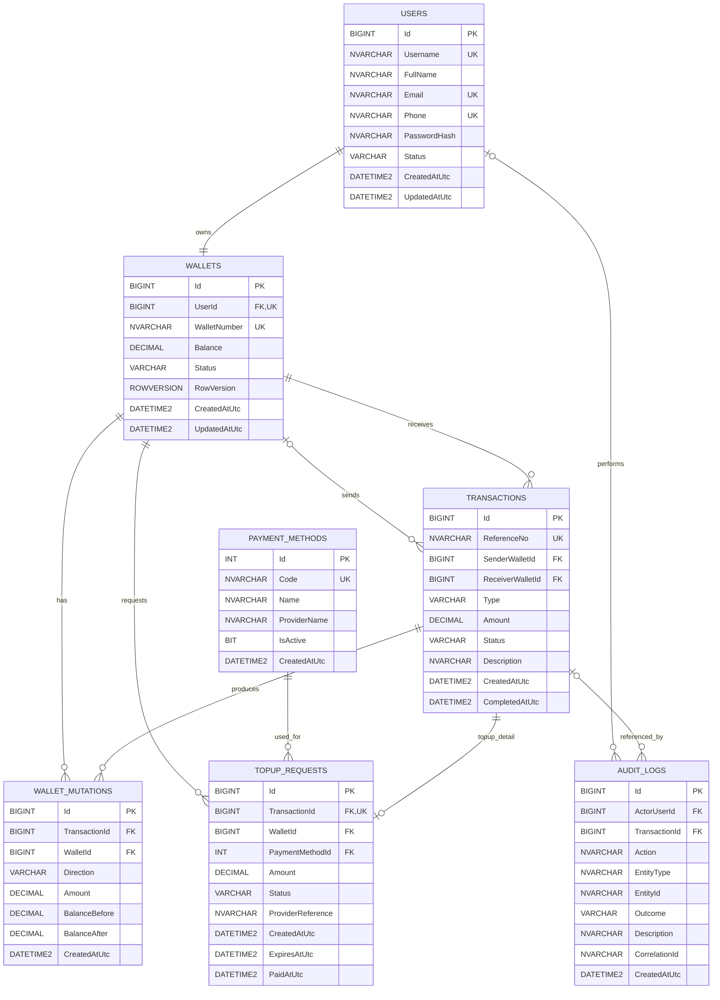

```mermaid
erDiagram
    USERS {
        BIGINT Id PK
        NVARCHAR Username UK
        NVARCHAR FullName
        NVARCHAR Email UK
        NVARCHAR Phone UK
        NVARCHAR PasswordHash
        VARCHAR Status
        DATETIME2 CreatedAtUtc
        DATETIME2 UpdatedAtUtc
    }

    WALLETS {
        BIGINT Id PK
        BIGINT UserId FK,UK
        NVARCHAR WalletNumber UK
        DECIMAL Balance
        VARCHAR Status
        ROWVERSION RowVersion
        DATETIME2 CreatedAtUtc
        DATETIME2 UpdatedAtUtc
    }

    TRANSACTIONS {
        BIGINT Id PK
        NVARCHAR ReferenceNo UK
        BIGINT SenderWalletId FK
        BIGINT ReceiverWalletId FK
        VARCHAR Type
        DECIMAL Amount
        VARCHAR Status
        NVARCHAR Description
        DATETIME2 CreatedAtUtc
        DATETIME2 CompletedAtUtc
    }

    WALLET_MUTATIONS {
        BIGINT Id PK
        BIGINT TransactionId FK
        BIGINT WalletId FK
        VARCHAR Direction
        DECIMAL Amount
        DECIMAL BalanceBefore
        DECIMAL BalanceAfter
        DATETIME2 CreatedAtUtc
    }

    PAYMENT_METHODS {
        INT Id PK
        NVARCHAR Code UK
        NVARCHAR Name
        NVARCHAR ProviderName
        BIT IsActive
        DATETIME2 CreatedAtUtc
    }

    TOPUP_REQUESTS {
        BIGINT Id PK
        BIGINT TransactionId FK,UK
        BIGINT WalletId FK
        INT PaymentMethodId FK
        DECIMAL Amount
        VARCHAR Status
        NVARCHAR ProviderReference
        DATETIME2 CreatedAtUtc
        DATETIME2 ExpiresAtUtc
        DATETIME2 PaidAtUtc
    }

    AUDIT_LOGS {
        BIGINT Id PK
        BIGINT ActorUserId FK
        BIGINT TransactionId FK
        NVARCHAR Action
        NVARCHAR EntityType
        NVARCHAR EntityId
        VARCHAR Outcome
        NVARCHAR Description
        NVARCHAR CorrelationId
        DATETIME2 CreatedAtUtc
    }

    USERS ||--|| WALLETS : owns

    USERS |o--o{ AUDIT_LOGS : performs

    WALLETS |o--o{ TRANSACTIONS : sends
    WALLETS ||--o{ TRANSACTIONS : receives

    WALLETS ||--o{ WALLET_MUTATIONS : has
    TRANSACTIONS ||--o{ WALLET_MUTATIONS : produces

    WALLETS ||--o{ TOPUP_REQUESTS : requests


    PAYMENT_METHODS ||--o{ TOPUP_REQUESTS : used_for

    TRANSACTIONS ||--o| TOPUP_REQUESTS : topup_detail

    TRANSACTIONS |o--o{ AUDIT_LOGS : referenced_by
```
